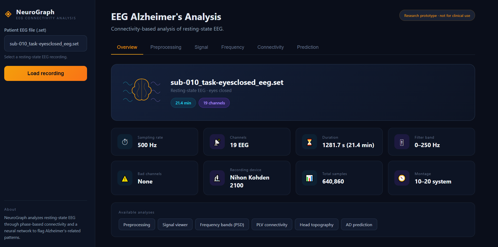

# NeuroGraph — EEG Alzheimer's Analysis

An end-to-end web tool for analyzing resting-state EEG and screening for
Alzheimer's disease from brain connectivity, built on the OpenNeuro
ds004504 dataset. It combines signal processing, a graph neural network,
and an interactive dashboard.

> Decision-support / research prototype — **not a medical device.**



## What it does

Upload a resting-state EEG recording (`.set`) and NeuroGraph lets you:

- **Inspect metadata** — sampling rate, channels, duration, filters, montage.
- **Preprocess** — resample, band-pass and notch filtering, and channel
  removal, applied consistently across every analysis.
- **View the raw signal** — choose channels and a time window.
- **Analyze frequency content** — relative power across delta–gamma bands.
- **Explore connectivity** — phase-locking-value (PLV) matrices and the
  strongest connections drawn on a 10–20 head layout, per frequency band.
- **Run a prediction** — a graph neural network classifies AD vs. healthy
  controls from alpha-band connectivity graphs.

## How it works

Each recording is split into epochs. For connectivity, every epoch becomes
a 19-node graph (electrodes = nodes, PLV = edges). A 2-layer graph
convolutional network (GCN) classifies each epoch's graph, and the
per-epoch predictions are aggregated by soft voting into one
recording-level result.

## Model

| | |
|---|---|
| Architecture | 2-layer GCN + MLP head |
| Input | 19-node alpha-band PLV graph, band-power node features |
| Task | AD vs. HC |
| Aggregation | Soft voting across epochs |
| Validation | Leave-one-subject-out (subject level) |
| Baseline | ~85% balanced accuracy (LOSO, AD–HC) |

The connectivity-graph approach and the ~85% LOSO baseline come from prior
research on this dataset. Reported figures reflect subject-level
leave-one-subject-out validation, not window-level accuracy.

## Tech stack

Python · FastAPI · PyTorch · MNE · scikit-learn · matplotlib · vanilla
HTML/CSS/JS frontend. Plots are rendered server-side and streamed to the
browser as images.

## Project structure
src/ core library
data_loader.py load EEG recordings
preprocessing.py filtering, epoching, normalization
features.py PLV connectivity, band powers
gnn.py GCN model + graph construction
gnn_train.py training on all subjects
gnn_inference.py recording-level prediction
visualization.py server-side plots
api.py FastAPI app and endpoints
scripts/ dataset building and training scripts
static/ web frontend (HTML/CSS/JS)
tests/ unit tests

## Running locally

```bash
python -m venv venv
venv\Scripts\activate            # Windows
pip install -r requirements.txt

# 1. build the dataset and train the model (requires the data locally)
python scripts/train_gnn.py

# 2. start the app
uvicorn src.api:app --reload
# open http://127.0.0.1:8000/app
```

## Data

This project uses the OpenNeuro **ds004504** dataset (88 subjects, 19-channel
EEG, 10–20 montage). The data is **not** included in this repository; download
it from OpenNeuro: https://openneuro.org/datasets/ds004504

Trained models and connectivity arrays are also not committed — they are
regenerated locally from the data.

## Tests

```bash
pytest
```

## Known limitations

- Epoching does not yet respect `boundary` annotations from the
  preprocessed recordings, so some windows may straddle data
  discontinuities.
- The prediction is a research prototype and is not clinically validated.